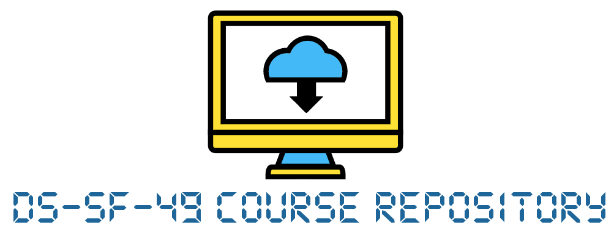

1. [Welcome](#welcome)
1. [Your Instructor](#team)
1. [Course Overview](#course)
1. [Course Schedule](#schedule)
1. [Projects](#projects)
1. [Tech Requirements](#tech)
1. [Classroom Tools](#slack)
1. [Student Expectations](#expectations)
1. [Office Hours](#hours)
1. [Student Feedback](#feedback)

---

## Course Overview
Welcome to the part time Data Science course at General Assembly! We are building a global community of lifelong learners who are excited about using data to solve real world problems. 

In this program, we will use Python to explore datasets, build predictive models, and communicate data driven insights. Specifically, you will learn how to:

- Define many of the approaches and considerations that data scientists use to solve real world problems.
- Perform exploratory data analysis with powerful programmatic tools in Python.
- Build and refine basic machine learning models to predict patterns from data sets.
- Communicate data driven insights to peers and stakeholders in order to inform business decisions.

### What You Will Learn

- **Statistical Analysis with Python**: 
 - Perform visual and statistical analysis on data using Python and its associated libraries and tools.
- **Data-Driven Decision-Making**: 
 - Define and determine the trade-offs involving feature selection, model accuracy, and data quality.
- **Machine Learning & Modeling Techniques**: 
 - Explore supervised learning techniques, inlcuding classification, regression, and decision trees.
- **Visualizations & Presentations**: 
 - Create visualizations and interactive notebooks to present to industry stakeholders.

### Python Version
The curriculum materials for this course are written in Python 3.6.

---

## Your Instructor

[Adam Jones](https://www.linkedin.com/in/adam-p-jones/)

---

**Course Times**

Monday/Wednesday: 6:30pm - 9:30pm

**Location:**

All courses / in-person office hours will be held in Classroom 2

GA, 225 Bush Street

## Curriculum Structure

---

General Assembly's Data Science part time materials are organized into **four** units.

| Unit   | Title  | Topics Covered  | Length | 
| ---    | ---    |  ---     | ---    |
| Unit 1 | Data Foundations               | Python Syntax, Development Environment | Lessons 1-4 |
| Unit 2 | Working with Data              | Stats Review, Visualization, & EDA     | Lessons 5-9  | 
| Unit 3 | Data Science Modeling          | Regression, Classification, & KNN      | Lessons 10-14  | 
| Unit 4 | Data Science Applications      | Decision Trees, NLP, & Flex Topics     | Lessons 15-19  | 

---

## Lesson Schedule

Here is the schedule we will be following for our part time data science course:

Date | Lesson  | Unit Number | Session Number |
--- | --- | ---  | ---  |
8/20 | [Welcome to Data Science][1-1A]                 | Unit 1 | Session 1 |
8/22 |[Your Development Environment][1-1B]            | Unit 1 | Session 2 | 
8/27 | [Python Foundations][1-1C]                      | Unit 1 | Session 3 |
8/29 | FLEX: Project Workshop + Presentations          | Unit 1 | Session 4 | 
--- | --- | ---  | ---  |
9/5 | [Exploratory Data Analysis in Pandas][1-1E]     | Unit 2 | Session 5 | 
9/10 | [Experiments & Hypothesis Testing][1-1F]        | Unit 2 | Session 6 | 
9/12 | [Data Visualization in Python][1-1G]            | Unit 2 | Session 7 | 
9/17 | [Statistics in Python][1-1H]                    | Unit 2 | Session 8 | 
9/19 | FLEX: Project Workshop + Presentations          | Unit 2 | Session 9 | 
--- | --- | ---  | ---  |
9/24 | [Linear Regression][1-1J]                       | Unit 3 | Session 10 | 
9/26 | [Train-Test Split & Bias-Variance][1-1K]        | Unit 3 | Session 11 | 
10/1 | [KNN / Classification][1-1L]                    | Unit 3 | Session 12 | 
10/3 | [Logistic Regression][1-1M]                     | Unit 3 | Session 13 | 
10/8 | FLEX: Project Workshop + Presentations          | Unit 3 | Session 14 | 
--- | --- | ---  | ---  |
10/10 | [Working With Data: APIs][1-1O]                 | Unit 4 | Session 15 | 
10/15 | [Intro to Natural Language Processing][1-1P]    | Unit 4 | Session 16 | 
10/17 | [Intro to Time Series][1-1Q]                    | Unit 4 | Session 17 | 
10/22 | [FLEX: Instructor Choice][1-1T]                 | Unit 4 | Session 18 | 
10/24 | FLEX: Review + Project Workshop                 | Unit 4 | Session 19 | 
10/29 | [Final Project Presentations][1-1U]             | Unit 4 | Session 20 | 

[1-1A]: ./lessons/01/
[1-1B]: ./lessons/02/
[1-1C]: ./lessons/03/

[1-1E]: ./lessons/05/
[1-1F]: ./lessons/06/
[1-1G]: ./lessons/07/
[1-1H]: ./lessons/08/

[1-1J]: ./lessons/10/
[1-1K]: ./lessons/11/
[1-1L]: ./lessons/12/
[1-1M]: ./lessons/13/

[1-1O]: ./lessons/15/
[1-1P]: ./lessons/16/
[1-1Q]: ./lessons/17/
[1-1T]: ./lessons/18/

[1-1U]: ./projects/final-projects/

---

## Project Structure

This course will ask you to complete a series of projects in order to practice and apply the skills covered in-class.

### Unit Projects
At the end of each Unit, you'll work on short structured projects. These activities will test your understanding of that unit’s most important concepts with in-class practice and instructor support. 

For those of you who want to go above and beyond, we’ve also included stretch options, bonus activities, and other opportunities for further reading and practice.

### Final Project

You'll also complete a [final project](./projects/04/), asking you to apply your skills to a real-world or business problem of your choice.

The capstone is an opportunity for you to demonstrate your new skills and tackle a pressing issue relevant to your life, industry, or organization. You’ll create a hypothesis, analyze internal data, and generate a working model, prototype, solution, or recommendation.

You will get structured guidance and designated time to work throughout the course. Final project deliverables include:

- **Proposal**: Describe your chosen problem and identify relevant data sets (confirming access, as needed).
- **Brief**:  Share a summary of your initial analysis and your next steps with your instructional team.
- **Report**: Submit a cleanly formatted Jupyter notebook (or other files) documenting your code and process for technical/peer stakeholders.
- **Presentation**: Present a summary of your business problem, approach, and recommendation to an audience of non-technical executive stakeholders.

---

### Project Breakdown

1. [Project 1: Python Technical Code Challenges][2-1A]
2. [Project 2: Exploratory Data Analysis][2-1B]
3. [Project 3: Modeling Practice][2-1C]
4. [Project 4: Final Project][2-1D]
    - Part 1: Proposal + Dataset
    - Part 2: Initial EDA Brief
    - Part 3: Technical Report
    - Part 4: Presentation

[2-1A]:  ./projects/01/
[2-1B]:  ./projects/02/
[2-1C]:  ./projects/03/
[2-1D]:  ./projects/04/

---

### Project Schedule

- Project 1: Due @ End of Unit 1
- Project 2: Due @ End of Unit 2
- Project 3: Due @ End of Unit 3
- Project 4 (Final):
    - Proposal + Dataset: Due @ End of Unit 2
    - Initial EDA Brief: Due @ End of Unit 3
    - Technical Report: Due @ End of Unit 4
    - Presentation: Due @ End of Unit 4

---

## Technology Requirements

### Hardware

1. 8GB Ram (at least)
2. 10GB Free Hard Drive Space (after installing Anaconda)

### Software

1. Download and Install [Anaconda with Python 3.6](https://www.continuum.io/downloads).

> Note: Anaconda provides support for two different versions of Python. Make sure to install the "Python 3.6" version.

**PC only**
- Install [Git Bash](https://git-for-windows.github.io/)

### Browser
- Google Chrome

###  Miscellaneous
- Text editor (we recommend [Atom](https://atom.io))
---

##  Slack

We'll use Slack for our class communications platform. Slack is a messaging platform where you can chat with your peers and instructors. We will use Slack to share information about the course, discuss lessons, and submit projects. Our Slack homepage is [dat-sf-49.slack.com](dat-sf-49.slack.com).

**Pro Tip**: If you've never used Slack before, check out these resources:
- [Intro to Slack](https://www.youtube.com/watch?v=9RJZMSsH7-g)
- [Slack Basics and Shortcuts](https://get.slack.help/hc/en-us/articles/217626358-Cheat-sheet-for-basics-and-shortcuts)
- [The Ultimate Slack Cheatsheet](https://chartmogul.attach.io/EyoxcOGL)

---

## Expectations

1. No more than 3 absences are allowed.
2. 80% of homework assignments must be completed.
3. Final project is mandatory.

---

## Office Hours
Every week, your instructional team will hold office hours where you can get in touch to ask questions about anything relating to the course. This is a *great opportunity* to follow up on questions or ask for more details about any topics covered so far.

* Instructor's Office Hours:

Weds: 5:30pm - 6:30pm (right before class)
- Additional hours available upon request

Slack us or post in our #officehours channel to reserve a time-slot!

---

## Student Feedback

Throughout the course, you'll be asked to provide feedback about your experience. This feedback is extremely important, as it helps us provide you with a better learning experience.

[**Exit Ticket Link**](http://bit.ly/DAT49_exitticket)

---

### Resources
* [PEP 8 - Style Guide for Python](http://www.python.org/dev/peps/pep-0008)
* [Learn How to Think Like a Computer Scientist](http://interactivepython.org/runestone/static/thinkcspy/toc.html#t-o-c)
* [Programming Cheat Sheets](./student-resources/cheat-sheets/)
* [Free textbooks](./student-resources/textbooks.md)
